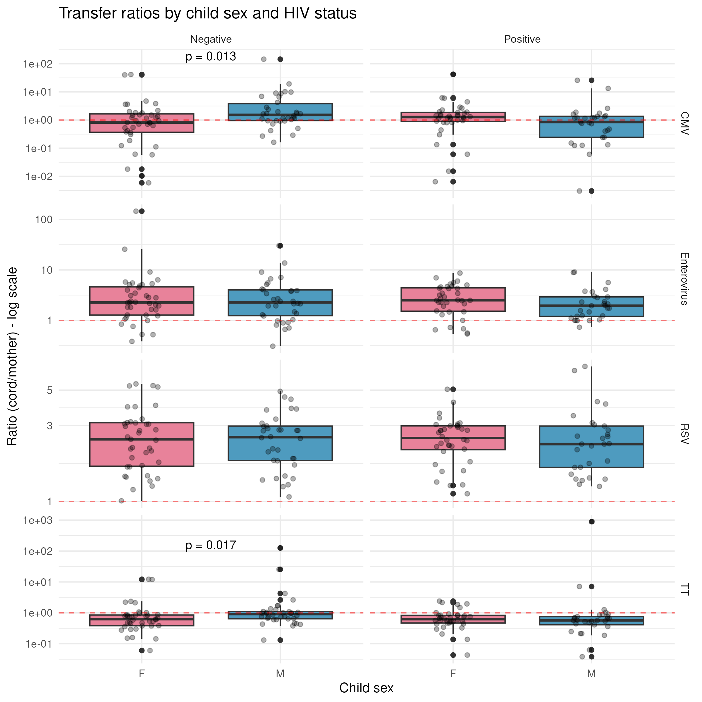
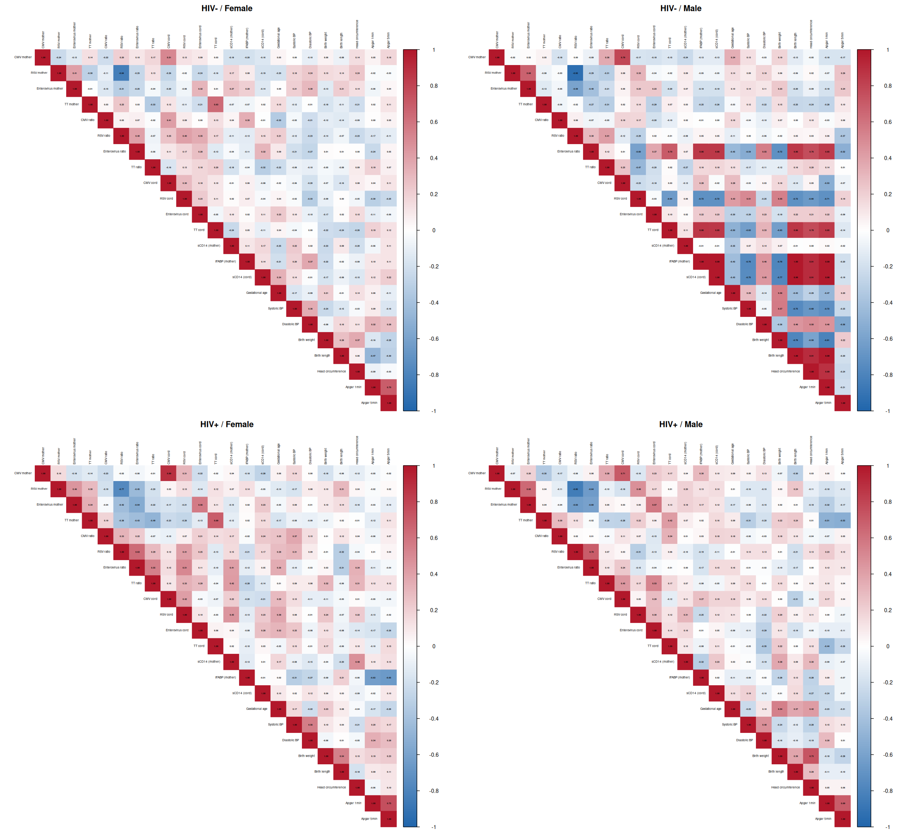
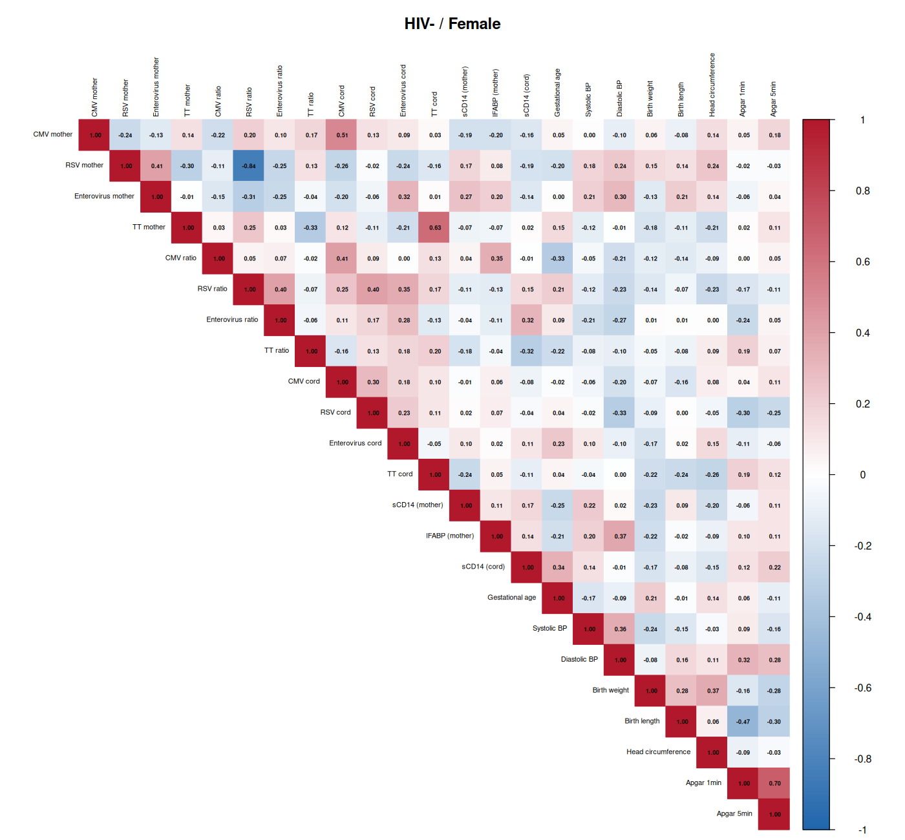
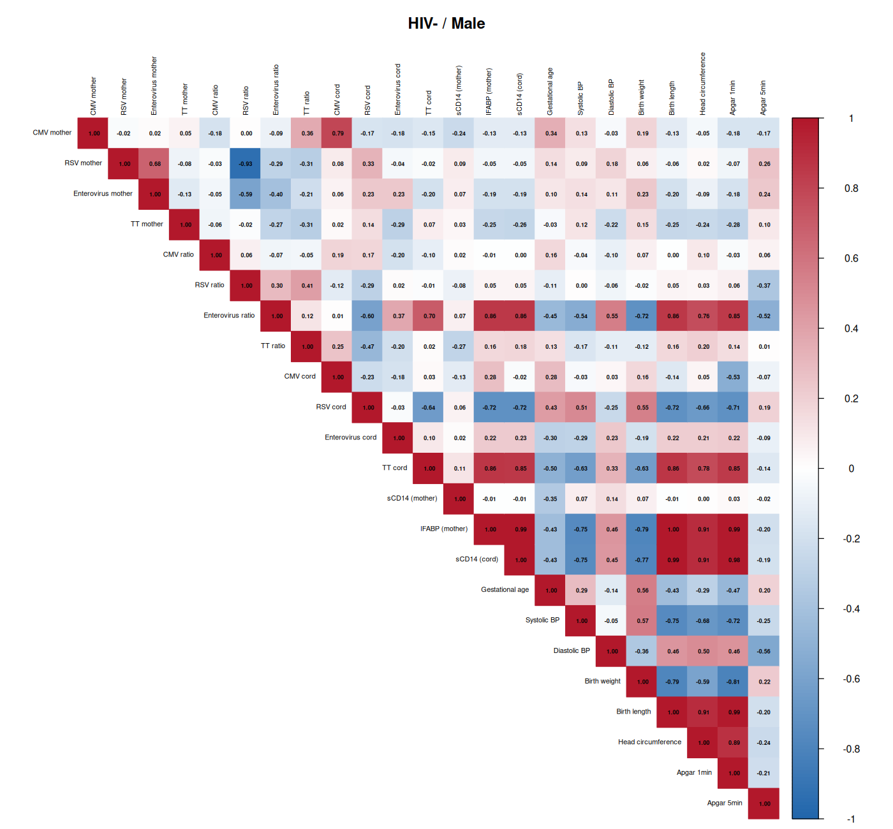
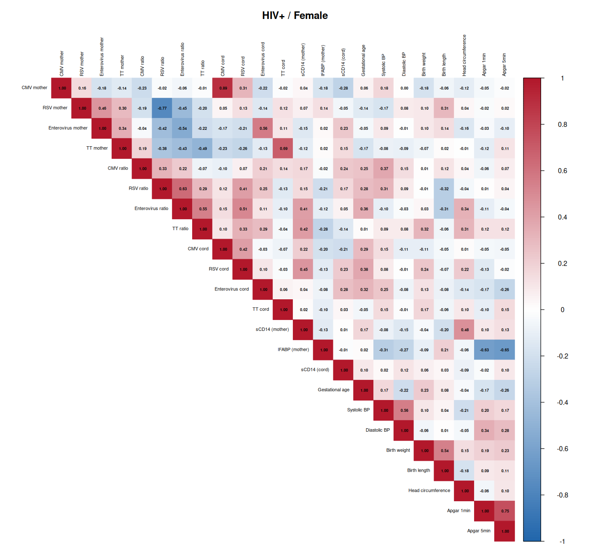
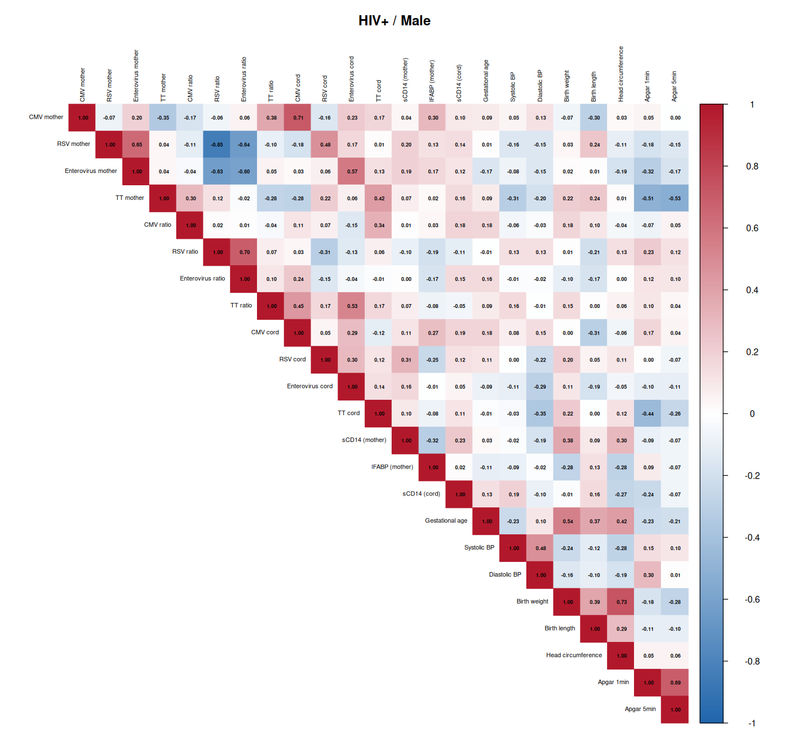

## Loading packages and data

```{r setup}
library(tidyverse)
library(here)
library(ggpubr)

donnees <- read_tsv(here("data/etude_mere_enfant.csv"), na = c("", "NA", "f"))
donnees <- donnees %>%
  mutate(`CMV cord` = as.numeric(`CMV cord`),
         Howmanylivingchildrendoyouhave = as.numeric(Howmanylivingchildrendoyouhave))
```

---

## 1️⃣ HIV, inflammation (sCD14) and intestinal damage (IFABP)

### sCD14 — inflammation marker

```{r q1_scd14}
t.test(`sCD14 [ng/ml]` ~ `HIV STATUS`, data = donnees)
```

```{r q1_scd14_boxplot}
ggplot(donnees, aes(x = `HIV STATUS`, y = `sCD14 [ng/ml]`, fill = `HIV STATUS`)) +
  geom_boxplot() +
  geom_jitter(alpha = 0.3, width = 0.2) +
  stat_compare_means(method = "t.test", label.x = 1.3, label = "p.format") +
  labs(title = "Inflammation (sCD14) by HIV Status",
       subtitle = "p < 0.001",
       x = "HIV Status", y = "sCD14 (ng/ml)") +
  scale_fill_manual(values = c("Negative" = "#2E86AB", "Positive" = "#A23B72")) +
  theme_minimal()
```

### IFABP — intestinal permeability marker

```{r q1_ifabp}
wilcox.test(`IFABP [pg/ml]` ~ `HIV STATUS`, data = donnees)
```

```{r q1_ifabp_boxplot}
ggplot(donnees, aes(x = `HIV STATUS`, y = `IFABP [pg/ml]`, fill = `HIV STATUS`)) +
  geom_boxplot() +
  geom_jitter(alpha = 0.3, width = 0.2) +
  stat_compare_means(method = "wilcox.test", label.x = 1.3, label = "p.format") +
  labs(title = "Intestinal permeability (IFABP) by HIV Status",
       subtitle = "p = 0.006",
       x = "HIV Status", y = "IFABP (pg/ml)") +
  scale_fill_manual(values = c("Negative" = "#2E86AB", "Positive" = "#A23B72")) +
  theme_minimal()
```

### Cord sCD14

```{r q1_cord}
t.test(`cord sCD14 [ng/ml]` ~ `HIV STATUS`, data = donnees)
```

> **Finding:** HIV is associated with **higher systemic inflammation**
> (sCD14: p < 0.001) but **not** with cord inflammation (p = 0.71).
> IFABP (intestinal) shows a significant median difference (p = 0.006).

---

## 2️⃣ Which antibody transfers best from mother to cord?

```{r q2_stats}
virus_ratio <- c("ratio CMV" = "CMV", "ratio RSV" = "RSV", 
                 "ratio ENTERO" = "Enterovirus", "ratio TT" = "TT")

for (nom in names(virus_ratio)) {
  vals <- donnees[[nom]]
  efficaces <- sum(vals > 1, na.rm = TRUE)
  total <- sum(!is.na(vals))
  cat(sprintf("\n=== %s ===\n", virus_ratio[nom]))
  cat(sprintf("Median = %.3f  |  Mean = %.3f\n", median(vals, na.rm = TRUE), mean(vals, na.rm = TRUE)))
  cat(sprintf("Efficient transfer (>1) : %d / %d (%.1f%%)\n", efficaces, total, 100*efficaces/total))
}
```

```{r q2_boxplot}
ratios_long <- donnees %>%
  pivot_longer(cols = c("ratio CMV", "ratio RSV", "ratio ENTERO", "ratio TT"),
               names_to = "virus", values_to = "ratio") %>%
  mutate(virus = recode(virus,
                        "ratio CMV" = "CMV",
                        "ratio RSV" = "RSV",
                        "ratio ENTERO" = "Enterovirus",
                        "ratio TT" = "TT"))

ggplot(ratios_long, aes(x = virus, y = ratio, fill = virus)) +
  geom_boxplot() +
  geom_hline(yintercept = 1, linetype = "dashed", color = "red", size = 1) +
  annotate("text", x = 4.5, y = 1.1, label = "Efficient transfer (ratio > 1)", 
           color = "red", hjust = 1) +
  scale_y_log10() +
  labs(title = "Mother-to-cord transfer ratios",
       subtitle = "RSV and Enterovirus: highly efficient. TT: poor transfer",
       x = "", y = "Ratio (cord / mother) - log scale") +
  theme_minimal()
```

```{r q2_bar}
pct <- data.frame(virus = c("CMV", "RSV", "Enterovirus", "TT"),
                  pct = c(56.6, 100, 83.6, 22.4))
ggplot(pct, aes(x = reorder(virus, pct), y = pct, fill = virus)) +
  geom_col() +
  geom_text(aes(label = sprintf("%.1f%%", pct)), vjust = -0.5) +
  labs(title = "Proportion of efficient transfers (ratio > 1)",
       x = "", y = "% of participants") +
  theme_minimal() + ylim(0, 110)
```

### Correlations between ratios

```{r q2_cor}
cor(donnees[, c("ratio CMV", "ratio RSV", "ratio ENTERO", "ratio TT")], 
    use = "pairwise.complete.obs") %>% round(3)
```

> **Finding:** **RSV** transfers best (100% of women, median = 2.47),
> followed by **Enterovirus** (83.6%, median = 2.30). **CMV** is mixed
> (56.6%, median = 1.18). **TT** transfers poorly (22.4%, median = 0.67).
> Correlations between ratios are very weak → each virus has its own
> transfer mechanism.

---

## 3️⃣ Which factors predict birth weight?

```{r q3_regression}
modele <- lm(`Birth weigh (tg)` ~ `Gestestational age of delivery` + 
               `child SEX` + `HIV STATUS` + 
               `Systolic blood pressure` + `Diastolic blood pressure` +
               `sCD14 [ng/ml]` + `HowmanydeliverieshaveyouhadintotalParity`,
             data = donnees)
summary(modele)
```

```{r q3_viz}
ggplot(donnees, aes(x = `Gestestational age of delivery`, y = `Birth weigh (tg)`)) +
  geom_point(alpha = 0.5, color = "#2E86AB") +
  geom_smooth(method = "lm", color = "#A23B72") +
  labs(title = "Gestational age vs Birth weight",
       subtitle = "Main predictive factor (p < 0.001)",
       x = "Gestational age (weeks)", y = "Birth weight (g)") +
  theme_minimal()
```

> **Finding:** Only 3 significant factors:
> - **Gestational age** (p < 0.001) — longer pregnancy → heavier baby
> - **Systolic blood pressure** (p = 0.018) — positive effect
> - **Diastolic blood pressure** (p = 0.005) — negative effect
>
> **HIV**, **sex**, **parity** and **sCD14** are not significant.
> The model explains ~25% of variance (R² = 0.25).

---

## 4️⃣ Does parity affect antibody transfer?

```{r q4_parite}
donnees <- donnees %>%
  mutate(parite_cat = case_when(
    HowmanydeliverieshaveyouhadintotalParity <= 1 ~ "Primiparous",
    HowmanydeliverieshaveyouhadintotalParity <= 3 ~ "Multiparous",
    TRUE ~ "Grand multiparous"
  ))

for (nom in names(virus_ratio)) {
  cat(sprintf("\n=== %s ===\n", virus_ratio[nom]))
  print(donnees %>%
    filter(!is.na(parite_cat)) %>%
    group_by(parite_cat) %>%
    summarise(
      n = n(),
      med_ratio = median(.data[[nom]], na.rm = TRUE),
      prop_efficace = sum(.data[[nom]] > 1, na.rm = TRUE) / sum(!is.na(.data[[nom]])) * 100
    ))
}
```

```{r q4_viz}
ratios_long <- donnees %>%
  pivot_longer(cols = c("ratio CMV", "ratio RSV", "ratio ENTERO", "ratio TT"),
               names_to = "virus", values_to = "ratio") %>%
  mutate(virus = recode(virus,
                        "ratio CMV" = "CMV",
                        "ratio RSV" = "RSV",
                        "ratio ENTERO" = "Enterovirus",
                        "ratio TT" = "TT"))

ggplot(ratios_long %>% filter(!is.na(parite_cat)), 
       aes(x = parite_cat, y = ratio, fill = parite_cat)) +
  geom_boxplot() +
  geom_hline(yintercept = 1, linetype = "dashed", color = "red", alpha = 0.5) +
  facet_wrap(~virus, scales = "free_y") +
  scale_y_log10() +
  labs(title = "Transfer ratio by parity",
       x = "", y = "Ratio (log)") +
  theme_minimal() + theme(legend.position = "none")
```

> **Finding:** Parity has **little effect** on transfer.
> Primiparous women may transfer **RSV** slightly better
> (median = 2.79 vs 2.26-2.31). For other viruses, differences are minimal.

---

## 5️⃣ Does birth weight affect antibody transfer?

```{r q5_poids}
donnees <- donnees %>%
  mutate(poids_cat = case_when(
    `Birth weigh (tg)` < 2500 ~ "Low birth weight (< 2.5kg)",
    `Birth weigh (tg)` <= 4000 ~ "Normal (2.5-4kg)",
    TRUE ~ "Macrosomic (> 4kg)"
  ))

for (nom in names(virus_ratio)) {
  c <- cor(donnees[["Birth weigh (tg)"]], donnees[[nom]], use = "complete.obs")
  cat(sprintf("%s vs Birth weight : r = %.3f\n", virus_ratio[nom], c))
}
```

```{r q5_viz}
ggplot(ratios_long, aes(x = `Birth weigh (tg)`, y = ratio, color = virus)) +
  geom_point(alpha = 0.5) +
  geom_hline(yintercept = 1, linetype = "dashed", color = "red", alpha = 0.5) +
  geom_smooth(method = "lm", se = FALSE) +
  facet_wrap(~virus, scales = "free_y") +
  scale_y_log10() +
  labs(title = "Transfer ratio vs birth weight",
       subtitle = "Very weak correlations (|r| < 0.09)",
       x = "Birth weight (g)", y = "Ratio (log)") +
  theme_minimal()
```

> **Finding:** No significant correlation between **birth weight**
> and **transfer ratios** (|r| < 0.09 for all). Antibody transfer
> appears independent of child weight.

---

## 6️⃣ Global correlations

```{r q6_cor_matrix}
vars <- c("ratio CMV", "ratio RSV", "ratio ENTERO", "ratio TT",
          "Birth weigh (tg)", "Gestestational age of delivery",
          "sCD14 [ng/ml]", "IFABP [pg/ml]",
          "HowmanydeliverieshaveyouhadintotalParity")
cor(donnees[, vars], use = "pairwise.complete.obs") %>% round(3)
```

### Ratio by HIV status

```{r q6_vih}
for (nom in names(virus_ratio)) {
  res <- donnees %>%
    group_by(`HIV STATUS`) %>%
    summarise(med = median(.data[[nom]], na.rm = TRUE))
  cat(sprintf("%s : HIV- = %.3f, HIV+ = %.3f\n", virus_ratio[nom], res$med[1], res$med[2]))
}
```

> **Finding:** HIV status does **not** affect transfer ratios
> (medians are nearly identical).

---

## 7️⃣ Deep dive: child sex as the main factor

Re-analyzing everything with **sex (F/M)** as the grouping factor,
**stratified by HIV status**.

### 7.1 Transfer ratios — sex × HIV

```{r q7_setup}
donnees <- donnees %>%
  mutate(parite_cat = case_when(
    HowmanydeliverieshaveyouhadintotalParity <= 1 ~ "Primiparous",
    HowmanydeliverieshaveyouhadintotalParity <= 3 ~ "Multiparous",
    TRUE ~ "Grand multiparous"))
```

```{r q7_ratios}
for (hiv_statut in c("Negative", "Positive")) {
  cat(sprintf("\n━━━ HIV %s ━━━\n", hiv_statut))
  sous <- donnees %>% filter(`HIV STATUS` == hiv_statut)
  
  virus_ratio <- c("ratio CMV" = "CMV", "ratio RSV" = "RSV", 
                   "ratio ENTERO" = "Enterovirus", "ratio TT" = "TT")
  
  for (nom in names(virus_ratio)) {
    cat(sprintf("\n◆ %s\n", virus_ratio[nom]))
    res <- sous %>%
      filter(!is.na(`child SEX`)) %>%
      group_by(`child SEX`) %>%
      summarise(
        n = n(),
        med = median(.data[[nom]], na.rm = TRUE),
        pct_efficace = round(100 * sum(.data[[nom]] > 1, na.rm = TRUE) / sum(!is.na(.data[[nom]])), 1)
      )
    print(res)
  }
}
```



```{r q7_pct_bar}
# % efficient transfer
pct_data <- donnees %>%
  filter(!is.na(`child SEX`)) %>%
  pivot_longer(cols = c("ratio CMV", "ratio RSV", "ratio ENTERO", "ratio TT"),
               names_to = "virus", values_to = "ratio") %>%
  mutate(virus = recode(virus, "ratio CMV" = "CMV", "ratio RSV" = "RSV",
                        "ratio ENTERO" = "Enterovirus", "ratio TT" = "TT")) %>%
  group_by(`HIV STATUS`, `child SEX`, virus) %>%
  summarise(
    n_total = sum(!is.na(ratio)),
    n_efficace = sum(ratio > 1, na.rm = TRUE),
    pct = 100 * n_efficace / n_total,
    .groups = "drop")

ggplot(pct_data, aes(x = `child SEX`, y = pct, fill = `child SEX`)) +
  geom_col() +
  geom_text(aes(label = sprintf("%.0f%%", pct)), vjust = -0.5, size = 3.5) +
  facet_grid(virus ~ `HIV STATUS`) +
  scale_fill_manual(values = c("F" = "#E8829A", "M" = "#4E9BBF")) +
  ylim(0, 115) +
  labs(title = "% efficient transfer by child sex and HIV status",
       x = "Child sex", y = "% efficient transfer") +
  theme_minimal() + theme(legend.position = "none")
```

> **Key finding:** In **HIV-** mothers, **boys** receive **CMV** better
> (70.6% vs 43.6% for girls, p = 0.013) and **TT** (38.2% vs 17.9%, p = 0.017).
> In **HIV+** mothers, the opposite: **girls** receive **CMV** better
> (66.7% vs 48.3%, p = 0.06 — trend).

### 7.2 Inflammation markers — sex × HIV

```{r q7_inflam}
for (hiv_statut in c("Negative", "Positive")) {
  cat(sprintf("\n━━━ HIV %s ━━━\n", hiv_statut))
  sous <- donnees %>% filter(`HIV STATUS` == hiv_statut)
  
  for (m in c("sCD14 [ng/ml]", "IFABP [pg/ml]", "cord sCD14 [ng/ml]")) {
    cat(sprintf("\n◆ %s\n", m))
    res <- sous %>%
      filter(!is.na(`child SEX`)) %>%
      group_by(`child SEX`) %>%
      summarise(
        n = n(),
        med = median(.data[[m]], na.rm = TRUE),
        moy = mean(.data[[m]], na.rm = TRUE)
      )
    print(res)
  }
}
```

```{r q7_inflam_viz, fig.height=5, fig.width=7}
ggplot(donnees %>% filter(!is.na(`child SEX`)), 
       aes(x = `child SEX`, y = `sCD14 [ng/ml]`, fill = `child SEX`)) +
  geom_boxplot() +
  geom_jitter(alpha = 0.3, width = 0.15) +
  facet_wrap(~`HIV STATUS`) +
  scale_fill_manual(values = c("F" = "#E8829A", "M" = "#4E9BBF")) +
  labs(title = "Inflammation (sCD14) by child sex and HIV status",
       subtitle = "No F vs M difference — but HIV+ > HIV- in both sexes",
       x = "Child sex", y = "sCD14 (ng/ml)") +
  theme_minimal() + theme(legend.position = "none")
```

### 7.3 Socio-demographic factors — sex × HIV

```{r q7_sociodemo}
for (hiv_statut in c("Negative", "Positive")) {
  cat(sprintf("\n━━━ HIV %s ━━━\n", hiv_statut))
  sous <- donnees %>% filter(`HIV STATUS` == hiv_statut)
  
  cat("\n◆ Birth weight (g)\n")
  res <- sous %>%
    filter(!is.na(`child SEX`)) %>%
    group_by(`child SEX`) %>%
    summarise(med = median(`Birth weigh (tg)`, na.rm = TRUE),
              moy = mean(`Birth weigh (tg)`, na.rm = TRUE))
  print(res)
  
  cat("\n◆ Gestational age\n")
  res <- sous %>%
    filter(!is.na(`child SEX`)) %>%
    group_by(`child SEX`) %>%
    summarise(med = median(`Gestestational age of delivery`, na.rm = TRUE),
              moy = mean(`Gestestational age of delivery`, na.rm = TRUE))
  print(res)
  
  cat("\n◆ Parity (number of deliveries)\n")
  res <- sous %>%
    filter(!is.na(`child SEX`)) %>%
    group_by(`child SEX`) %>%
    summarise(med = median(HowmanydeliverieshaveyouhadintotalParity, na.rm = TRUE),
              moy = mean(HowmanydeliverieshaveyouhadintotalParity, na.rm = TRUE))
  print(res)
}
```

```{r q7_parite_viz}
ggplot(donnees %>% filter(!is.na(`child SEX`)), 
       aes(x = `child SEX`, fill = parite_cat)) +
  geom_bar(position = "fill") +
  facet_wrap(~`HIV STATUS`) +
  scale_fill_manual(values = c("Primiparous" = "#FDE74C", "Multiparous" = "#9BC53D", 
                                "Grand multiparous" = "#C3423F")) +
  labs(title = "Parity distribution by child sex and HIV",
       subtitle = "HIV-: more primiparous. HIV+: more grand multiparous",
       x = "Child sex", y = "Proportion", fill = "Parity") +
  theme_minimal()
```

### 7.4 Maternal viral loads — sex × HIV

```{r q7_virus_mere}
for (hiv_statut in c("Negative", "Positive")) {
  cat(sprintf("\n━━━ HIV %s ━━━\n", hiv_statut))
  sous <- donnees %>% filter(`HIV STATUS` == hiv_statut)
  
  for (nm in c("CMV mother", "RSV mother", "Enterovirus mother", "TT mother")) {
    cat(sprintf("\n◆ %s\n", nm))
    res <- sous %>%
      filter(!is.na(`child SEX`)) %>%
      group_by(`child SEX`) %>%
      summarise(med = median(.data[[nm]], na.rm = TRUE))
    print(res)
  }
}
```

### 🎯 Summary: what sex reveals

| Aspect | Finding |
|--------|---------|
| **CMV transfer** | HIV-: boys transfer better (70.6% vs 43.6%, p=0.013). HIV+: reverse trend (girls 66.7% vs 48.3%) |
| **TT transfer** | HIV-: boys transfer better (38.2% vs 17.9%, p=0.017). HIV+: no difference |
| **RSV transfer** | Universal (100%) in all subgroups — no sex/HIV effect |
| **Inflammation (sCD14)** | No F/M difference — but HIV+ > HIV- in every sex |
| **Parity** | HIV-: mothers of girls are more often primiparous. HIV+: similar distribution |
| **Gestational age** | Similar across groups (~39-40 weeks) |

---

## 📋 Summary table

| Question | Answer |
|----------|--------|
| HIV → more inflammation? | **Yes** — sCD14 higher (p < 0.001) |
| HIV → intestinal damage? | **Yes** — IFABP higher (p = 0.006) |
| Best transferred antibody? | **RSV** (100%, median = 2.47) then **Enterovirus** (84%, med = 2.30) |
| Worst transferred? | **TT** (22%, median = 0.67) |
| Does parity affect transfer? | **Very little** — slight advantage for primiparous for RSV |
| Does birth weight affect transfer? | **No** — near-zero correlations |
| What predicts birth weight? | **Gestational age** (+++), systolic/diastolic blood pressure |

---

## 8️⃣ Correlation matrices by child sex and HIV status

Correlation heatmaps for **23 markers** (viral loads, transfer ratios,
inflammation markers, clinical measurements).

**Blue** = positive correlation, **Red** = negative correlation.

### Combined view (2×2)



### Individual panels for closer inspection

**HIV- / Female**



**HIV- / Male**



**HIV+ / Female**



**HIV+ / Male**



### Key observations from the correlation matrices

| Observation | Groups |
|-------------|--------|
| **CMV mother ↔ CMV cord** strongly correlated (r ≈ 0.6-0.7) in all 4 groups | All |
| **Birth weight ↔ Gestational age** moderate positive correlation (r ≈ 0.4) | All |
| **Systolic BP ↔ Diastolic BP** moderate correlation | All |
| **Transfer ratios** are largely independent of each other | All |
| **sCD14** and **IFABP** show little correlation with viral markers | All |

```{r}
# Add your code here to explore further!
```